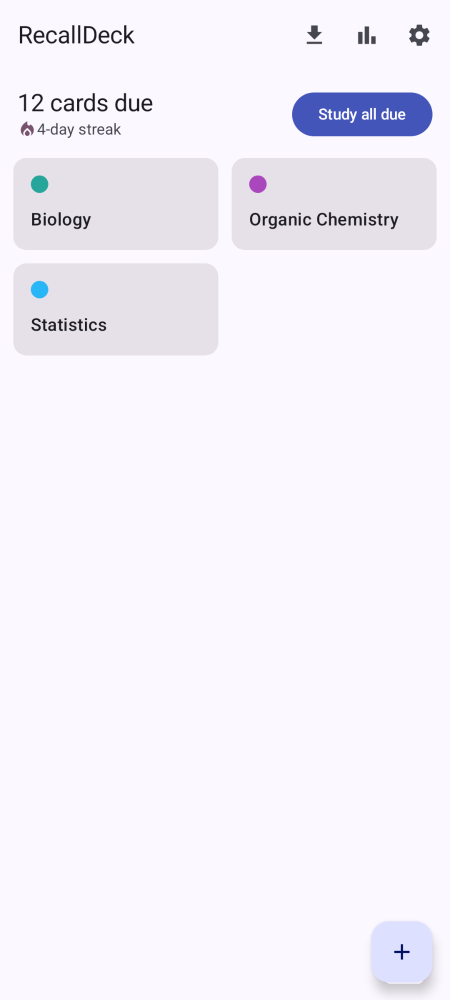
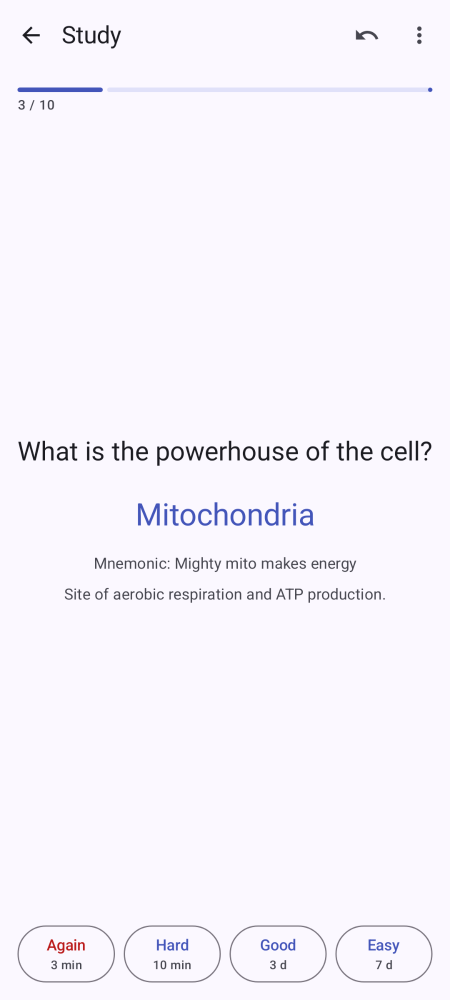
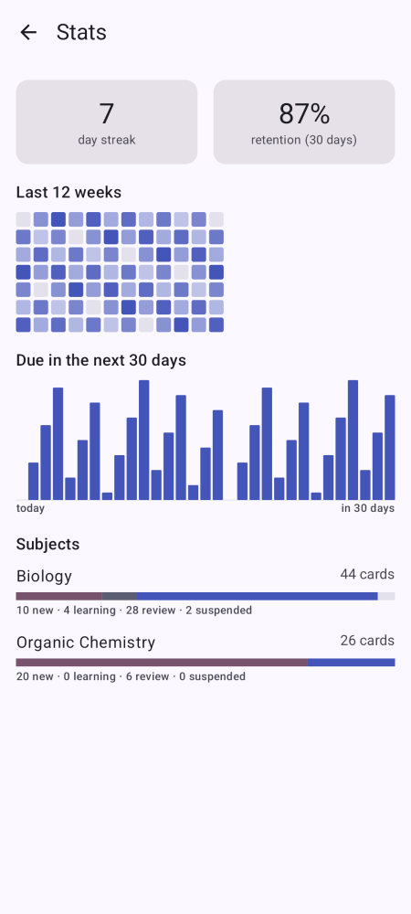
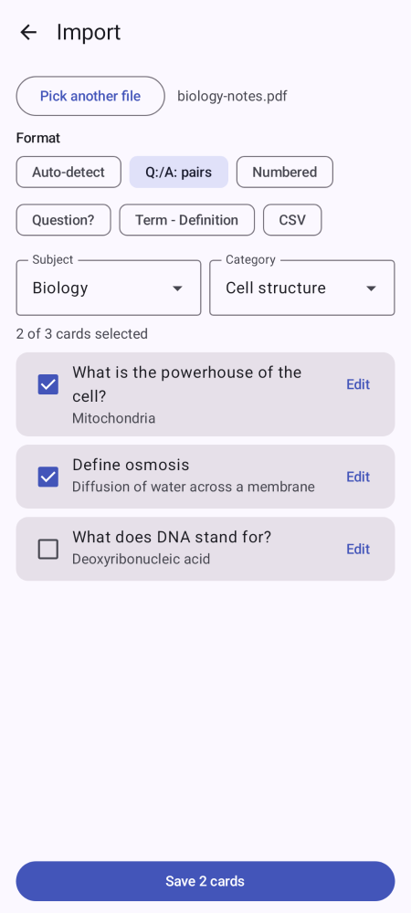
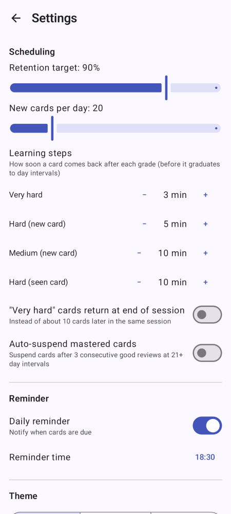
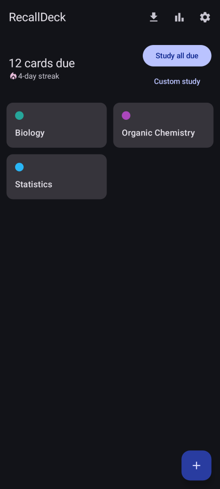

# RecallDeck

A fully offline native Android flashcard app for university studying. No accounts, no cloud
sync, no analytics — the app requires no internet permission.

## Features

- **FSRS-6 scheduling** — spaced repetition with a configurable retention target and daily
  new-card limit; grade buttons show the predicted next interval.
- **Study modes** — due review (all or scoped to a subject/category), random mix, and custom
  sessions (count, order, cram mode that never affects scheduling).
- **Cloze cards** — `{{c1::text}}` syntax creates one card per cloze index; optional
  type-answer mode with an "almost" hint for near-misses.
- **Import** — pick a PDF/TXT/CSV file, parse it with heuristic presets (Q:/A: pairs, numbered,
  question-mark, term–definition, CSV), then review and edit every card before saving.
- **Stats** — current streak, 12-week review heatmap, 30-day due forecast, 30-day retention,
  and a per-subject card-state breakdown.
- **Reminders** — optional daily "N cards due" notification at a user-set time.
- **Backup** — versioned JSON export/import of everything (including scheduling state) and
  per-subject CSV export.
- **Theme** — system / light / dark.

## Screenshots

| Home | Study | Stats |
|---|---|---|
|  |  |  |

| Import | Settings | Dark mode |
|---|---|---|
|  |  |  |

## Build

Requires JDK 17 and the Android SDK (compileSdk 35, build-tools 35.0.0).

```
./gradlew assembleDebug
```

The debug APK is written to `app/build/outputs/apk/debug/app-debug.apk` and is also uploaded
as an artifact by every CI run.

## Verify

```
./gradlew testDebugUnitTest assembleDebug verifyPaparazziDebug
```

Screenshot goldens live in `app/src/test/snapshots/images/`; re-record with
`./gradlew recordPaparazziDebug`.

See `docs/SPEC.md` for the full specification, `docs/DECISIONS.md` for recorded ambiguity
decisions, and `AGENTS.md` for contributor rules.
